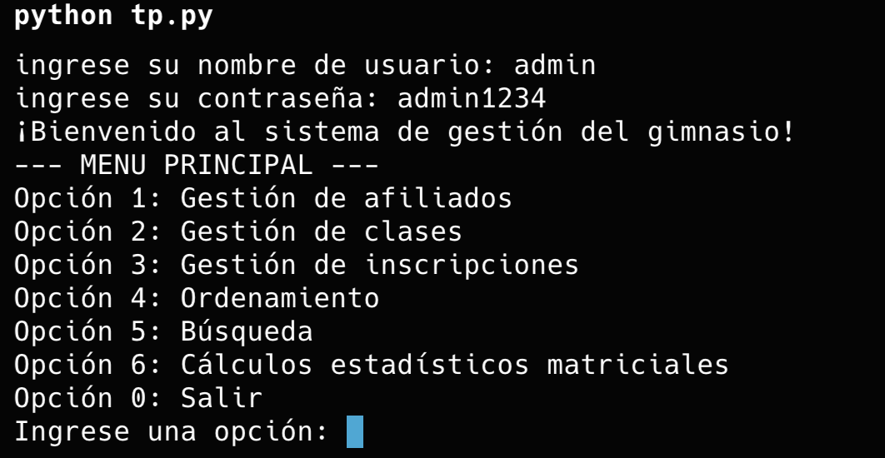
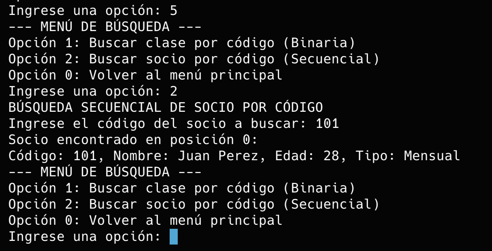
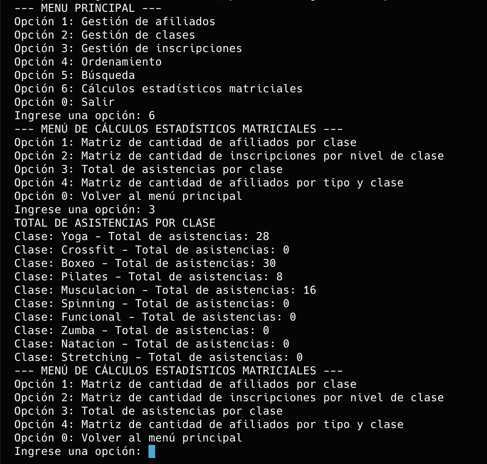

# GymControl - Documentación técnica

## Portada


**Materia:** Algoritmos y Estructura de Datos 1 / Programación 1

**Proyecto:** Sistema de gestión para gimnasios

**Comisión:** lunes por la noche - N.º 577502

**Integrantes:** Rodrigo García Solá, Lucas Cragaris, Tomás van Nynatten, Javier Candalaft y Edney Ribeiro

**Repositorio:** https://github.com/rodrings/GymControl

**Fecha:** 3 de septiembre de 2026

El docente confirmó que podemos presentar el trabajo entre los cinco integrantes.

<!-- pagebreak -->

## 1. Objetivo y problemática

GymControl reemplaza registros manuales dispersos por un programa de consola que centraliza socios, clases e inscripciones. Su objetivo es mantener relaciones consistentes, controlar cupos y facilitar búsquedas, ordenamientos y estadísticas básicas.

La aplicación trabaja únicamente en memoria: no utiliza archivos de datos, base de datos, interfaz gráfica ni programación orientada a objetos.

## 2. Cómo ejecutar

Se requiere Python 3.9 o posterior.

```bash
python3 tp.py
```

Credenciales de demostración:

- Usuario: `admin`
- Contraseña: `admin1234`

El login admite hasta tres intentos. Al salir, todas las modificaciones hechas durante la sesión se pierden.

## 3. Estructura general

El archivo `tp.py` está organizado en estos bloques:

1. Constantes de índices y matrices con datos iniciales.
2. Funciones estadísticas basadas en matrices.
3. Búsquedas y ordenamientos.
4. Validaciones y funciones auxiliares.
5. Gestión de socios.
6. Gestión de clases.
7. Gestión de inscripciones.
8. Menús y programa principal.

Flujo principal:

```text
login()
  -> main_menu()
       -> affiliate_menu()
       -> clases_menu()
       -> inscription_menu()
       -> opcion_menu_ordenamiento()
       -> opcion_menu_busqueda()
       -> matrix_menu()
```

## 4. Matrices y listas de cadenas

Cada entidad se representa mediante una lista de listas. Las constantes evitan números mágicos al acceder a las columnas.

| Matriz | Formato de fila | Contenido textual |
|---|---|---|
| `login_users` | `[usuario, contraseña]` | Usuario y contraseña. |
| `affiliates` | `[nombre, código, edad, tipo, teléfono]` | Nombre y teléfono. |
| `classes` | `[código, nombre, nivel, cupos]` | Nombre de la clase. |
| `enrollments` | `[código, socio, clase, asistencias, estado]` | Relaciona códigos de otras matrices. |

Valores codificados:

- Tipo de socio: `1 = Mensual`, `2 = Libre`, `3 = Premium`.
- Nivel de clase: `1 = Principiante`, `2 = Intermedio`, `3 = Avanzado`.
- Estado de inscripción: `1 = Activa`, `2 = Inactiva`.

La matriz de socios posee una columna de teléfono. La PR #8 incorporó su validación mediante regex y completó su uso en el alta, la modificación, el listado y la confirmación de baja.

## 5. Funciones estadísticas

| Función | Descripción |
|---|---|
| `affiliates_by_class_matrix()` | Construye una matriz donde cada fila agrupa códigos de socios por clase. |
| `affiliates_by_class()` | Muestra la cantidad de inscripciones asociadas a cada clase. |
| `attendances_by_class_matrix()` | Agrupa asistencias según la clase correspondiente. |
| `total_attendances_by_class()` | Usa `map` y `reduce` para calcular el total de asistencias de cada clase. |
| `enrollment_by_class_level_matrix()` | Agrupa inscripciones en tres filas, una por nivel. |
| `affiliates_by_type_and_class_matrix()` | Construye una matriz de tres tipos de socio por cantidad de clases. |

## 6. Búsquedas y ordenamientos

| Función | Técnica | Resultado |
|---|---|---|
| `search_position()` | `filter` y una condición lambda recibida como parámetro. | Primera posición que cumple la condición o `-1`. |
| `buscar_clase_binaria()` | Ordena copias de las columnas por código y aplica búsqueda binaria. | Clase encontrada o mensaje de ausencia. |
| `buscar_socio_secuencial()` | Búsqueda secuencial por código. | Posición y datos del socio. |
| `ordenar_socios_por_edad()` | Selección. | Copia de socios ordenada por edad. |
| `ordenar_clases_por_nivel()` | Inserción. | Copia de clases ordenada por nivel. |
| `ordenar_inscripciones_por_asistencias()` | Burbujeo. | Copia de inscripciones ordenada por asistencias. |

Los ordenamientos trabajan sobre copias de filas y no modifican las matrices originales.

## 7. Validaciones y funciones auxiliares

| Función | Descripción |
|---|---|
| `es_entero()` | Comprueba si un valor puede convertirse a entero. |
| `es_flotante()` | Comprueba si un valor puede convertirse a decimal. |
| `es_string()` | Comprueba si un valor puede convertirse a cadena. |
| `es_nombre_clase_valido()` | Regex que acepta letras, espacios, tildes y `ñ`. |
| `pedir_entero()` | Repite una entrada hasta obtener un entero y, opcionalmente, respetar límites. |
| `get_level_name()` | Traduce el código de nivel a texto. |
| `get_type_name()` | Traduce el código de tipo de socio a texto. |
| `search_position()` | Usa `filter` y una condición para obtener la posición de la primera fila coincidente. |
| `search_class_position()` | Reutiliza `search_position()` con una lambda sobre el código de clase. |
| `search_affiliate_position()` | Reutiliza `search_position()` con una lambda sobre el código de socio. |
| `search_inscription_position()` | Devuelve el índice de una inscripción o `-1`. |
| `search_user_position()` | Busca el usuario mediante `re.fullmatch` sin distinguir mayúsculas. |
| `does_class_code_exist()` | Informa si existe un código de clase. |
| `does_affiliate_code_exist()` | Informa si existe un código de socio. |
| `remove_enrollment_at()` | Elimina una fila de inscripción por posición. |
| `remove_enrollments_by_affiliate()` | Elimina las inscripciones asociadas a un socio. |
| `remove_enrollments_by_class()` | Elimina las inscripciones asociadas a una clase. |
| `input_option()` | Valida una opción entre 0 y 4; quedó definida pero no se usa en el flujo actual. |

## 8. Login

| Función | Descripción |
|---|---|
| `login()` | Solicita usuario y contraseña, reutiliza `search_user_position()` y bloquea después de tres intentos fallidos. |

`search_user_position()` usa la bandera `re.IGNORECASE`, por lo que `ADMIN` y `admin` encuentran el mismo usuario. La contraseña sí distingue mayúsculas y minúsculas.

## 9. Gestión de socios

| Función | Descripción |
|---|---|
| `sumar_afiliados()` | Solicita nombre, edad, tipo y teléfono validado; genera el próximo código y agrega una fila. |
| `eliminar_afiliados()` | Solicita código y confirmación, elimina el socio y sus inscripciones asociadas. |
| `modify_affiliate()` | Permite conservar o reemplazar nombre, edad, tipo y teléfono. |
| `list_affiliates()` | Muestra código, nombre, edad, tipo y teléfono. |

`es_telefono_valido()` exige el formato `XX-XXXX-XXXX` antes de guardar un teléfono nuevo o modificado.

## 10. Gestión de clases

| Función | Descripción |
|---|---|
| `sumar_clase()` | Valida nombre, nivel y capacidad; genera el código y agrega la fila. |
| `eliminar_clase()` | Elimina una clase y sus inscripciones después de confirmar. |
| `modify_clase()` | Permite cambiar nombre, nivel y capacidad. |
| `list_clases()` | Muestra una tabla con código, nombre, nivel y cupos disponibles. |

## 11. Gestión de inscripciones

| Función | Descripción |
|---|---|
| `is_affiliate_enrolled_in_class()` | Usa `filter` y una lambda para detectar una inscripción activa equivalente. |
| `alta_inscripcion()` | Valida clase, cupo, socio y duplicados; crea una inscripción activa y descuenta un cupo. |
| `list_inscripciones()` | Resuelve los códigos y muestra nombres, asistencias y estado. |
| `clases_de_socio()` | Usa `filter` para elegir inscripciones activas y `map` para convertirlas en nombres de clase. |
| `listar_clases_socio()` | Solicita un socio y presenta sus clases activas. |
| `baja_inscripcion()` | Cambia una inscripción activa a inactiva y devuelve un cupo. |
| `modify_inscripcion()` | Modifica asistencias o estado y ajusta cupos al activar o desactivar. |

## 12. Menús

| Función | Responsabilidad |
|---|---|
| `input_clases_option()` | Valida opciones del menú de clases. |
| `clases_menu()` | Ejecuta el ABM de clases. |
| `input_affiliate_option()` | Valida opciones del menú de socios. |
| `affiliate_menu()` | Ejecuta el ABM de socios. |
| `input_inscription_option()` | Valida opciones del menú de inscripciones. |
| `inscription_menu()` | Ejecuta el ABM de inscripciones y el listado por socio. |
| `menu_busqueda()` | Valida opciones de búsqueda. |
| `opcion_menu_busqueda()` | Ejecuta búsquedas hasta volver al menú principal. |
| `menu_ordenamiento()` | Valida opciones de ordenamiento. |
| `opcion_menu_ordenamiento()` | Ejecuta el ordenamiento seleccionado. |
| `input_matrix_option()` | Valida opciones de estadísticas. |
| `matrix_menu()` | Ejecuta los reportes matriciales. |
| `input_main_option()` | Valida opciones de 0 a 6. |
| `main_menu()` | Coordina todos los submenús. |

## 13. Uso de `map`, `filter`, `reduce` y regex

### `map` y `reduce`

`total_attendances_by_class()` aplica `map` sobre las listas de asistencias de cada clase. Dentro de cada elemento utiliza `reduce` con acumulador inicial `0` para obtener el total.

### `filter`

`search_position()` filtra índices aplicando una condición lambda sobre cada fila. `is_affiliate_enrolled_in_class()` filtra inscripciones por socio, clase y estado activo. `clases_de_socio()` filtra las inscripciones activas del socio antes de mapearlas a nombres.

### Expresiones regulares

`es_nombre_clase_valido()` valida nombres mediante el patrón `^[A-Za-zÁÉÍÓÚáéíóúÑñ\s]+$`. `search_user_position()` usa `re.fullmatch(..., re.IGNORECASE)` para comparar usuarios. `es_telefono_valido()` valida teléfonos con el patrón `\d{2}-\d{4}-\d{4}`.

## 14. Capturas de funcionamiento

### Inicio de sesión y menú principal



### Consulta de socios y clases



### Reportes matriciales



Las capturas se generaron a partir de ejecuciones reales del `tp.py` correspondiente a esta rama.

## 15. Aportes y ramas por integrante

| Integrante | Rama | Pull requests y aporte |
|---|---|---|
| Javier Candalaft | `dev-canda` | Base del sistema, migración desde JSON y PR #5: matrices de usuarios, `reduce`, login, regex, documentación y PDFs. |
| Lucas Cragaris | `dev-lucas` | PR #1: documentación y clases activas por socio. PR #7: prevención de duplicados y regex con espacios/tildes. |
| Rodrigo García Solá | `dev-rodri` | PR #3: refactor completo de las estructuras a matrices e integración de sus operaciones. |
| Tomás van Nynatten | `dev-tom` | PR #4: teléfonos precargados. PR #8 integrada: validación y CRUD del teléfono. |
| Edney Ribeiro | `dev-ed` | PR #9: función genérica `search_position()` y reutilización de `filter` y lambdas en búsquedas de socios y clases. |

## 16. Alcance y decisiones

- La integración incluye la gestión completa de teléfonos de la PR #8 y la búsqueda genérica de la PR #9.
- El docente confirmó que podemos presentar el trabajo entre los cinco.
- La información se administra en memoria y se reinicia al cerrar el programa, de acuerdo con el alcance definido.
- Los casos límite de liberación de cupos al eliminar socios y de referencias manualmente alteradas no forman parte de los requisitos funcionales obligatorios.
- Los flujos principales de socios, clases, inscripciones, búsquedas, ordenamientos y reportes fueron probados.

## 17. Trazabilidad final

| Elemento exigido | Ubicación |
|---|---|
| Portada, objetivo, alcance y problemática | Portada y secciones 1 a 3 de este documento; propuesta en `GymControl.md` |
| Funcionalidades y estructura | Secciones 3 a 12 de este documento |
| Matrices y listas de strings | Sección 4 |
| `map`, `filter`, `reduce` y regex | Sección 13 |
| Capturas | Sección 14 y `docs/capturas/` |
| Repositorio | Portada y README |
| Historial y aporte individual | Sección 15 y `Modificaciones.md` |
| Pendientes | Sección 16 y `Modificaciones.md` |

Los contenidos técnicos, la documentación y la evidencia individual en Git están cubiertos para la entrega escrita. La comisión está completa y el docente confirmó que podemos presentarlo entre los cinco.
